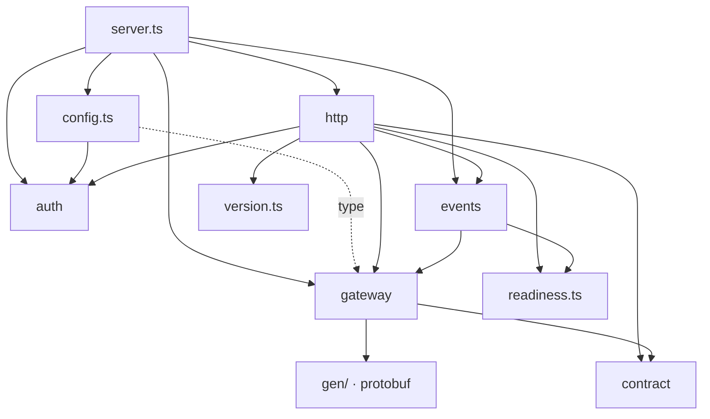
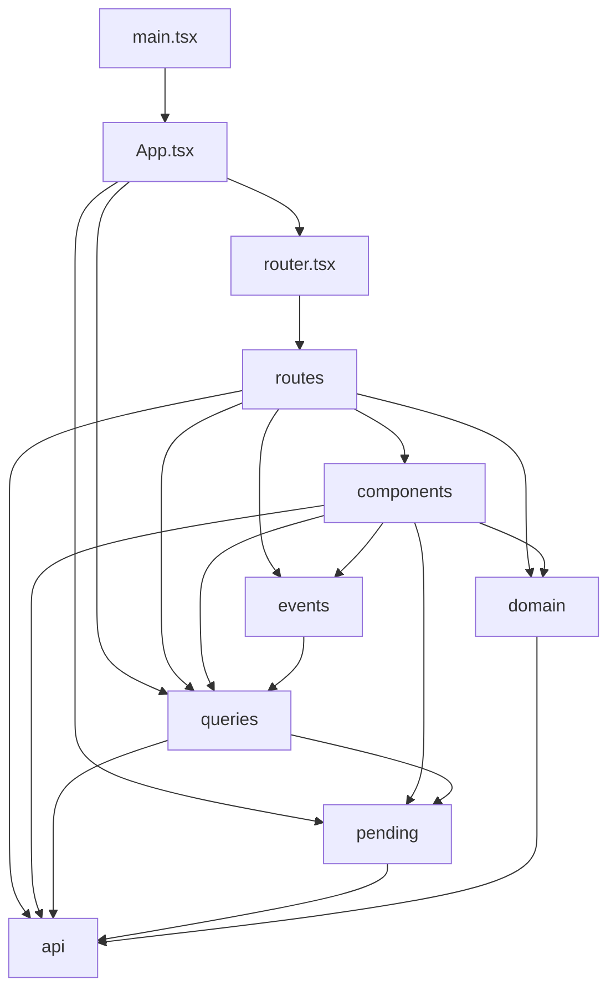
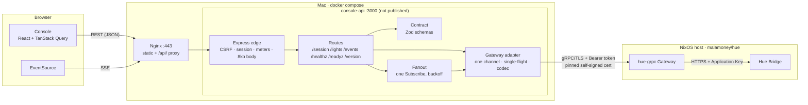
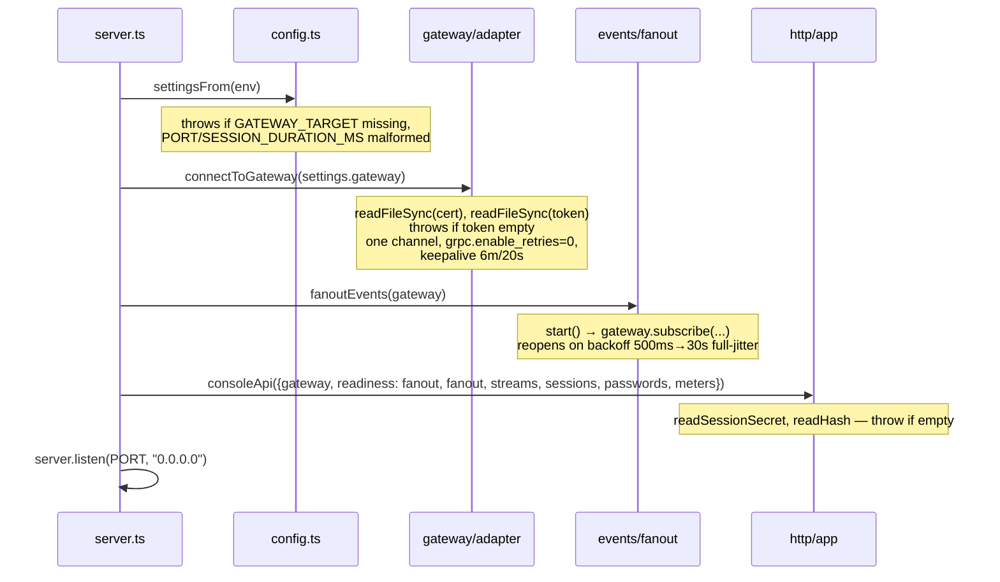
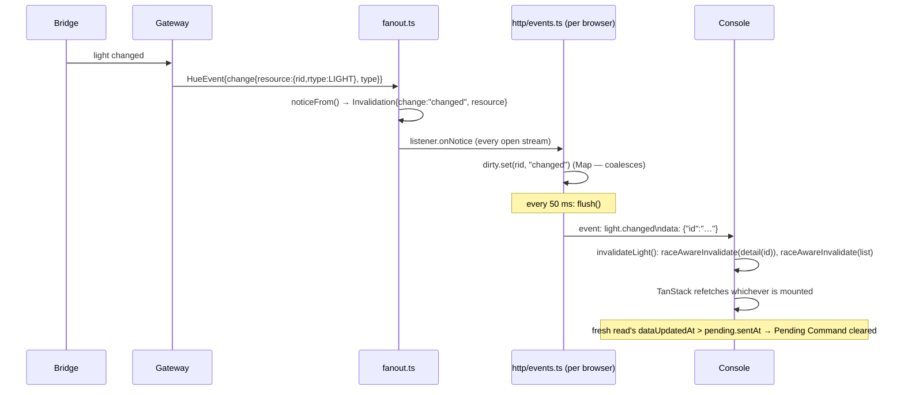
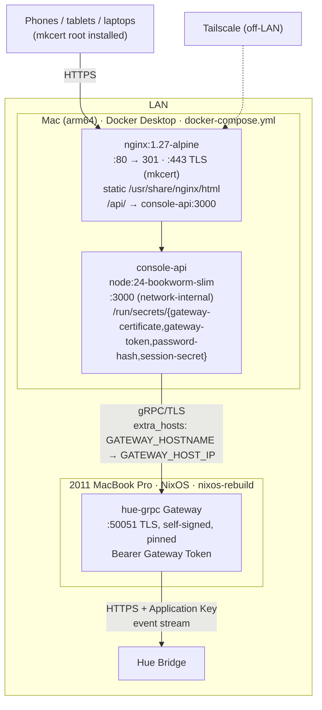

# sharpn — Repository Analysis

_Analysed at commit `0bfb85c` (main, 2026-09-15). Everything below was read from
the working tree, the git history, and a local run of `npm run typecheck` and
`npm test`; nothing is inferred from the README alone._

---

## Table of contents

1. [Summary for a new developer](#1-summary-for-a-new-developer)
2. [Architecture & structure](#2-architecture--structure)
3. [Technology & stack](#3-technology--stack)
4. [Overall architecture, assessed](#4-overall-architecture-assessed)
5. [Entry points & flow](#5-entry-points--flow)
6. [Code quality](#6-code-quality)
7. [Security](#7-security)
8. [Configuration & environment](#8-configuration--environment)
9. [Documentation & maintainability](#9-documentation--maintainability)
10. [Data & state management](#10-data--state-management)
11. [Performance & scalability](#11-performance--scalability)
12. [Git & history](#12-git--history)
13. [What's missing](#13-whats-missing)
14. [Appendix: diagrams](#14-appendix-diagrams)

---

## 1. Summary for a new developer

**What it is.** A small, LAN-only web app for controlling Philips Hue lights in
one household. It does not talk to the Hue Bridge itself; it talks to a
separate gRPC service (the **Gateway**, from the sibling repo
[`malamoney/hue`](https://github.com/malamoney/hue)) that owns the Bridge.

**Three tiers, two of them here:**

| Tier | Where | Owns |
| --- | --- | --- |
| **Console** (`apps/console`) | Browser, served by Nginx | React UI: light list, detail page, controls, login |
| **Console API** (`apps/console-api`) | Node process in Docker | REST + Server-Sent Events for the browser; one gRPC channel to the Gateway; auth; rate limits |
| **Gateway** (not in this repo) | NixOS box next to the Bridge | Bridge credentials, retries, event recovery |

**The five ideas you need before touching code** (all in `CONTEXT.md` and
`docs/adr/`):

1. **An update never returns the new light state** — only an *Acknowledgement*
   (which resources changed, what was refused). ADR 0001.
2. **Live updates carry ids only** (`light.changed {id}`), never the changed
   fields. The browser re-reads. ADR 0002.
3. **A Pending Command is "what the person asked for", never "what is true".**
   It is shown differently and is cleared by the next fresh read, not by the
   Acknowledgement. `CONTEXT.md`.
4. **A colour and a colour temperature can't be set in one request** — refused
   at the type level (`ts-proto oneof=unions`) *and* at the HTTP boundary.
   ADR 0005.
5. **Sessions are stateless signed cookies; one shared password; no
   revocation.** ADR 0006.

**Daily commands:**

```
nvm use               # Node 24
npm ci
npm run typecheck     # all three workspaces
npm test              # console-api (101 tests) + console (265 tests)
npm run dev -w apps/console         # Vite dev server, proxies /api → :3000
npm start -w apps/console-api       # needs GATEWAY_TARGET + four secret files
scripts/e2e.sh up && npm run test:gateway -w apps/e2e   # full Docker stack
```

**Where things live:** REST contract = `apps/console-api/src/contract/`
(Zod, single source of truth). gRPC = `apps/console-api/src/gateway/` (only
place protobuf is named). Routes = `apps/console-api/src/http/`. Browser
state = `apps/console/src/{queries,pending,events}/`.

---

## 2. Architecture & structure

### 2.1 Overall architecture

A **two-service, layered monolith-per-service** arrangement — not
microservices in the organisational sense (one author, one repo, one deploy),
but two independently containerised processes with a hard network boundary
between them and a third external service (the Gateway) reached over
gRPC/TLS.

```
Browser ──HTTPS: REST + SSE──▶ Nginx ──HTTP──▶ Console API ──gRPC/TLS──▶ Gateway ──HTTPS──▶ Hue Bridge
         └────────── one Mac, two containers ──────────┘  └── NixOS host (other repo) ──┘
```

Inside the Console API the shape is **ports-and-adapters**: a thin HTTP edge,
a contract layer (Zod schemas), and a single gRPC adapter behind an interface
(`Gateway`) that tests replace with a table-driven fake.

Inside the Console the shape is **React + TanStack Query as the read cache**,
with a deliberately separate "Pending Commands" store because the mutation
response structurally cannot confirm the new value.

### 2.2 Directory structure

```
.
├── apps/
│   ├── console/            The browser app. Vite + React 19 + Chakra UI 3.
│   │   ├── src/api/        fetch wrapper, ApiError, hand-restated contract types
│   │   ├── src/components/ Presentational + control components (17 files)
│   │   ├── src/domain/     Pure functions: colour maths, sorting, labels
│   │   ├── src/events/     EventSource wrapper + LiveLightsProvider
│   │   ├── src/pending/    Pending Command store (outside the query cache)
│   │   ├── src/queries/    TanStack Query keys, client, invalidation, useUpdateLight
│   │   ├── src/routes/     Login, AuthenticatedLayout, LightList, LightDetail
│   │   ├── src/test/       Shared test helpers
│   │   ├── nginx.conf      Production reverse proxy (baked into the image)
│   │   └── Dockerfile      node:24 build stage → nginx:1.27-alpine runtime
│   ├── console-api/        The Node service.
│   │   ├── src/auth/       argon2id password check; HMAC-signed session cookie
│   │   ├── src/contract/   Zod schemas: Light, Command, Acknowledgement, errors, login; OpenAPI generator
│   │   ├── src/events/     One shared gRPC Subscribe, backoff, fan-out to listeners
│   │   ├── src/gateway/    gRPC adapter, codec (proto ⇄ contract), credentials, single-flight, status mapping
│   │   ├── src/gen/        ts-proto output. Committed. Generated — do not edit.
│   │   ├── src/http/       Express app, routes, error envelope, meters, SSE
│   │   ├── src/server.ts   Composition root
│   │   ├── src/config.ts   Env → Settings, fail-fast
│   │   ├── openapi.json    Generated from contract/. Test-guarded.
│   │   └── Dockerfile      node:24-bookworm-slim (glibc, for @node-rs/argon2)
│   └── e2e/                Layer-2 (Vitest vs. real Gateway) and layer-3 (Playwright via Nginx) tests
├── proto/hue/v1/           Vendored .proto files from malamoney/hue at proto/PINNED
├── docs/
│   ├── adr/                Six Architecture Decision Records
│   ├── runbooks/           Five operator runbooks
│   └── deployment.md       First-time setup
├── scripts/                Proto vendoring/checks, OpenAPI gen, deploy, e2e, smoke probe
├── tools/e2e/              Dockerfile + entrypoints that build the real Gateway and a fake Bridge
├── docker-compose.yml      Production: nginx + console-api
├── docker-compose.e2e.yml  Test stack: fake-bridge + gateway + console-api + nginx
├── buf.yaml / buf.gen.yaml protoc configuration (ts-proto, oneof=unions)
├── CONTEXT.md              Project vocabulary (domain glossary)
└── README.md
```

Not tracked but present locally: `.env`, `secrets/`, `certs/`, `.e2e/`,
`dist/`, `node_modules/`.

### 2.3 Main modules and their relationships

**Console API** — module-level import graph (non-test files; arrows = "imports from"):



`contract/` and `auth/` import nothing internal. `gen/` is imported **only**
by `gateway/` — enforced by `gateway/protobuf-stays-inside.test.ts`, which
scans every source file for a `gen/` import. `contract/` must stay
browser-importable (no Node, no protobuf) — enforced by
`contract/browser-safe.test.ts`.

**Console** — module-level import graph:



`api/` is the leaf (types + fetch). `domain/` is pure functions with no
React.

### 2.4 Circular dependencies

**None at the module level in either app.** Both graphs above are DAGs. At
the file level there is one intentional forward-reference pattern in
`useUpdateLight.ts` (`fireRef` so `settle` can call `fire` before `fire` is
declared) — a closure trick, not an import cycle. `config.ts` importing
`auth/session.ts` for a constant and a `type` from `gateway/` is
one-directional.

### 2.5 Design patterns

| Pattern | Where | Notes |
| --- | --- | --- |
| **Composition root / manual DI** | `server.ts` builds everything and hands it to `consoleApi(parts)` | No DI container. Every collaborator is an interface (`Gateway`, `Meter`, `Sessions`, `PasswordCheck`, `Fanout`, `StreamRegistry`) |
| **Ports & adapters** | `gateway/` is the only adapter; `Gateway` interface is the port | Tests drive `app.ts` with a table-driven fake Gateway |
| **Anti-corruption layer** | `gateway/codec.ts` | `LightGet` → `Light`, `LightCommand` → `LightPut`. Protobuf types never leak upward |
| **Result type instead of exceptions** | `GatewayResult<T>`, `LightCommandReading`, `Spend` | Discriminated unions; routes never `catch` |
| **Single-flight (request coalescing)** | `gateway/single-flight.ts` | Concurrent identical reads share one RPC; explicitly *not* a cache |
| **Fan-out / pub-sub** | `events/fanout.ts` | One upstream `Subscribe`, N SSE listeners |
| **Exponential backoff with full jitter** | `events/backoff.ts` | Mirrors the Gateway's own |
| **Sliding-window log rate limiter** | `http/meter.ts` | Timestamp log, not a counter — no double-spend at the window edge |
| **Stateless signed token** | `auth/session.ts` | `id.expiresAt.hmac`, base64url, constant-time compare |
| **Schema-as-source-of-truth** | `contract/*.ts` (Zod) → `openapi.json` | Test fails if the document drifts |
| **Clock injection** | `meterAtMost(limit, now)`, `sessionsSignedWith(secret, now, duration)`, `EventRouteTiming` | Time is a parameter so tests never sleep |
| **Provider/context** (React) | `PendingCommandsProvider`, `LiveLightsProvider` | Small, single-purpose contexts |
| **Race-aware invalidation** | `queries/raceAwareInvalidate.ts` | Defers invalidation until any in-flight fetch of the same key settles |
| **Per-key in-flight gating** (slider policy) | `queries/useUpdateLight.ts` | At most one PATCH per light; latest value held and sent on settle |
| **Fail-fast configuration** | `config.ts` | Missing `GATEWAY_TARGET` or empty secret files throw at startup |
| **Guard-tests for invariants** | `protobuf-stays-inside.test.ts`, `browser-safe.test.ts`, `gen.test.ts`, `openapi.test.ts`, `check-codegen-flags.sh` | Architectural rules asserted by tests/CI rather than by convention |

---

## 3. Technology & stack

### 3.1 Languages, frameworks, libraries

| Area | Choice | Installed version |
| --- | --- | --- |
| Language | TypeScript (strict, `noUncheckedIndexedAccess`, ES2023, ESM/NodeNext) | 5.9.3 |
| Runtime | Node | ≥ 24 (`.nvmrc`: 24) |
| HTTP server | Express | 5.2.1 |
| Validation / contract | Zod | 4.6.2 |
| gRPC client | `@grpc/grpc-js` | 1.14.4 |
| Protobuf runtime | `@bufbuild/protobuf` | 2.14.1 |
| Codegen | `@bufbuild/buf` + `ts-proto` (`oneof=unions`, `outputServices=grpc-js`) | 1.72.0 / 2.12.3 |
| Password hashing | `@node-rs/argon2` (argon2id, native, glibc prebuilds) | 2.2.1 |
| UI | React + react-dom | 19.3.0 |
| Router | `react-router` (v7 data router API, `createBrowserRouter`) | 7.18.3 |
| Server state | `@tanstack/react-query` | 5.102.8 |
| Component library | `@chakra-ui/react` v3 + `@emotion/react` | 3.37.0 / 11.14.0 |
| Bundler | Vite | 8.3.0 |
| Unit tests | Vitest (+ jsdom, Testing Library, jest-dom, user-event) | 5.0.0 |
| E2E | Playwright | 1.63.0 |
| Reverse proxy | Nginx | 1.27-alpine |
| Containers | Docker Compose (secrets, healthchecks, `--wait`) | — |
| Fonts | Plus Jakarta Sans via Google Fonts (external) | — |

### 3.2 Dependency health

- `npm audit` (prod and dev): **0 vulnerabilities**.
- `npm outdated`: everything is within one minor of latest except the majors
  below. Nothing is deprecated.

| Package | Current | Latest major | Risk |
| --- | --- | --- | --- |
| `react-router` | 7.18.3 | 8.4.0 | Medium — v8 changes the data-router API; the Console uses only `createBrowserRouter`, `NavLink`, `useNavigate`, `useLocation`, `useParams`, `useMatch`, `Outlet`, so migration should be small |
| `typescript` | 5.9.3 | 7.0.2 | Low-medium — TS 7 is the Go-port compiler; config is conservative so it should port |
| `@types/node` | 24.13.4 | 26.6.0 | None — keep pinned to Node 24 |
| `@testing-library/jest-dom` | 6.9.1 | 7.0.1 | Low |

### 3.3 Build tools, package managers, task runners

- **npm workspaces** (three: `apps/console`, `apps/console-api`, `apps/e2e`);
  one root `package-lock.json`. `allowScripts` whitelists the three packages
  with install scripts.
- **Root scripts**: `build`, `typecheck`, `test` fan out with
  `--workspaces --if-present`. `proto:vendor[:check]`, `proto:generate[:check]`,
  `proto:flags:check`, `openapi:generate` are bash scripts under `scripts/`.
- **No ESLint, Prettier, Biome, or `.editorconfig`.** Formatting is by hand
  (see §6.2).
- **Bash scripts** (`set -euo pipefail` throughout) do the vendoring, checks,
  deploy, e2e lifecycle, and smoke probe.

---

## 4. Overall architecture, assessed

### 4.1 Component diagram



### 4.2 Is the architecture appropriate?

**Yes, and unusually well-fitted to its scale.** The problem is "one
household, a few browsers, tens of bulbs, on a LAN". The design makes
choices that are only correct at that scale and says so explicitly:

- Id-only invalidations (ADR 0002) cost a LAN round-trip per event —
  wrong for a cloud product, right here, and it buys a bounded, coalescing
  per-browser buffer with no overflow path.
- No session store (ADR 0006) — right for one shared password.
- No CA for the gRPC hop (ADR 0004) — right for one verifier.
- In-memory rate limiters and single-flight — right for one process.

### 4.3 Biggest strengths

1. **The contract is one artefact.** Zod schemas → runtime validation →
   TypeScript types → OpenAPI document, with a test that fails if the
   committed document drifts.
2. **Protobuf is quarantined**, and the quarantine is *tested*
   (`protobuf-stays-inside.test.ts`). The rest of the service cannot name a
   `LightGet`.
3. **Honesty about uncertainty is built into the types.** `Outcome` has an
   `unknown` arm; `DEADLINE_EXCEEDED` on a mutation is
   `MUTATION_OUTCOME_UNKNOWN`, never "failed"; the UI clears the Pending
   Command and re-reads rather than asserting anything.
4. **Retries are off at every level** (`grpc.enable_retries: 0`, no retry in
   the adapter, `retry: false` in TanStack Query for reads too) because a
   mutation that half-happened cannot be undone by asking again.
5. **Failure modes are named and distinguishable.** Sixteen error codes, each
   with one HTTP status forever; `UNAVAILABLE` from the channel vs. from the
   Gateway is told apart by the presence of trailers.
6. **Time is injectable everywhere**, so 366 unit tests run in seconds with
   one deliberate 5-second real-deadline test.
7. **Operational reality is documented**: five runbooks, a smoke probe that
   proves the one thing `/readyz` cannot (that events actually flow), and a
   recorded 34-hour half-open-socket outage that led to keepalive pings.
8. **Every non-obvious line has a "why" comment** that reads like an ADR in
   miniature. This is the most thoroughly self-explaining codebase of its
   size I have seen.

### 4.4 Architectural decisions that concern me

1. **The Console hand-copies the contract** (`apps/console/src/api/types.ts`).
   `LIGHT_ARCHETYPES` (50 entries) and `ERROR_CODES` (16 entries) are
   duplicated verbatim. The file says this is deliberate ("a browser-facing
   project reaching into a server package's source is the coupling that
   distinction exists to rule out"), but `contract/browser-safe.test.ts` says
   the opposite — "The Console consumes these schemas rather than redeclaring
   the shapes". One of those two comments is wrong, and **nothing tests that
   the two lists match**. The `openapi.json` that exists precisely to be
   consumed by other tiers is consumed by nothing. Recommendation: either
   generate `types.ts` from `openapi.json` (e.g. `openapi-typescript`) or add
   a test in `apps/e2e` or the Console that imports both and asserts equality.

2. **The `subscriber_behind` Gap is logged and then forgotten.** When the
   Console API itself falls behind the Gateway, the fanout logs an error and
   the SSE layer pulses `resyncing: true`, but **no browser refetches the
   collection** — `LiveLightsProvider` only does a full resync on
   `reconnecting → connected`. ADR 0002 says a Gap of this cause is a bug in
   this process, but a bug that silently leaves every browser stale is
   worse than one that costs a `ListLights`. Consider forwarding a distinct
   status that triggers the prefix invalidation.

3. **Session renewal on every request writes a `Set-Cookie` on every
   authenticated response** — including every `GET /lights/:id` fired by
   an Invalidation. Cheap, but it means a 30-day sliding window slides on
   *background* traffic, so a tablet on the wall stays signed in forever
   with no human action. ADR 0006 accepts this; worth being sure it's wanted.

4. **The keepalive floor is six minutes** because the Gateway serves gRPC
   with Python defaults that punish keener pings. A dead subscription is
   therefore undetected for ~6.5 minutes. This is a Gateway-side constraint,
   but it is the weakest link in the "live" story and the runbook exists
   because of it.

5. **External font dependency in a LAN-only app.** `index.html` loads Plus
   Jakarta Sans from `fonts.googleapis.com`. If the Mac has no internet the
   Console still works (fallback stack is set), but the page leaks a request
   to Google on every load and renders differently offline. Self-hosting
   the woff2 files is trivial.

6. **No lint/format tooling.** Style is remarkably consistent for hand-formatted
   code, but 80-column wrapping is already inconsistent (e.g.
   `http/session.ts` line 12 is a 100-char import; test files widely exceed
   80). A `prettier --check` in CI would cost nothing.

7. **Two divergent "trust proxy" assumptions.** `app.set("trust proxy", 1)`
   is correct behind exactly one Nginx, and the comment says the process is
   never reachable otherwise. But `npm run dev` for the Console proxies to a
   *directly-run* `console-api` on `:3000`, where `req.ip` will be the Vite
   dev server's loopback — every dev browser shares one login-rate-limit
   bucket. Harmless in practice; worth a comment.

---

## 5. Entry points & flow

### 5.1 Entry points

| Entry | File | What happens |
| --- | --- | --- |
| Console API process | `apps/console-api/src/server.ts` | `settingsFrom(process.env)` → `connectToGateway` → `fanoutEvents` → `openStreams` → `consoleApi(parts)` → `createServer().listen(0.0.0.0:PORT)`; `SIGTERM`/`SIGINT` → `fanout.stop()`, `streams.closeAll()`, `server.close()`, `gateway.close()` |
| Console bundle | `apps/console/src/main.tsx` | `ChakraProvider` → `App` → `QueryClientProvider` → `PendingCommandsProvider` → `RouterProvider` |
| OpenAPI generator | `apps/console-api/src/contract/write-openapi.ts` (via `scripts/generate-openapi.sh`) | Compiles to a temp dir, writes `openapi.json` |
| Password hasher | `apps/console-api/scripts/hash-password.mjs` | `npm run hash-password -- '<pw>'` |
| Smoke probe | `scripts/smoke-live-updates.mjs` (copied into the container) | Mints a session with the container's own secret, opens SSE, flips a light, waits for `light.changed` |
| Deploy | `scripts/deploy.sh` | Derives `GIT_SHA`/`PROTO_REVISION`, `docker compose up --build --detach` |
| E2E lifecycle | `scripts/e2e.sh {up,down,logs}` | Mints secrets, brings up 4 containers with `--wait` |

### 5.2 Startup sequence (Console API)



### 5.3 Routing / dispatch

**Nginx** (`apps/console/nginx.conf`):

- `:80` → 301 to HTTPS.
- `location = /api/v1/events` → proxy, `proxy_read_timeout 75s`,
  `proxy_buffering off`.
- `location /api/` → proxy, `proxy_read_timeout 15s`.
- `location /` → `try_files $uri /index.html` (SPA).
- `proxy_pass http://console_api` with **no trailing path**, so `/api/v1/…`
  reaches Express intact.

**Express** (`http/app.ts`) — middleware order is load-bearing and commented:

```
1. app.set("trust proxy", 1); disable x-powered-by; disable etag
2. csrfGuard                       every non-GET/HEAD/OPTIONS: Origin host must equal Host
3. /api/v1/lights  → requireSession → meterMutations (60/min per session id)
4. /api/v1/events  → requireSession
5. /api/v1/session → loginRateLimit (5/min per IP, POST only)
6. express.json({ limit: "8kb" })
7. healthRoutes              GET /healthz, /readyz, /version   (no auth, no /api prefix)
8. /api/v1 sessionRoutes     POST /session, DELETE /session
9. /api/v1 lightRoutes       GET /lights, GET /lights/:id, PATCH /lights/:id
10. /api/v1 eventRoutes      GET /events (SSE)
11. unservedPath             400 INVALID_REQUEST in the standard envelope (not 404)
12. bodyThatCouldNotBeRead   error handler: 400 for body-parser errors, else log + bare 500 with x-correlation-id
```

**React Router** (`router.tsx`): `/login`; `AuthenticatedLayout` wrapping
`/` (list) and `/lights/:id` (detail). `useAuthRedirect` subscribes to a
module-level "401 seen" event bus in `api/client.ts` and navigates to
`/login` with `state.from`.

### 5.4 Typical request flow — `PATCH /api/v1/lights/:id`

```mermaid
sequenceDiagram
  participant B as Browser
  participant N as Nginx
  participant E as Express edge
  participant R as lightRoutes
  participant A as Gateway adapter
  participant G as Gateway
  B->>N: PATCH /api/v1/lights/abc {brightness: 40}<br/>Cookie: sharpn_session, Origin
  N->>E: + Host, X-Forwarded-*
  E->>E: csrfGuard: Origin host == Host ✓
  E->>E: requireSession: HMAC verify, not expired ✓ → reissue cookie
  E->>E: meterMutations: spend(sessionId) ✓
  E->>E: express.json (≤8kb)
  E->>R: PATCH handler
  R->>R: readLightCommand(body) — Zod strict; both colour+temp → 400
  R->>A: gateway.updateLight(id, command)
  A->>A: commandFor() → LightPut (oneof union)
  A->>G: UpdateLight + x-correlation-id + Bearer, deadline 5s
  G-->>A: MutationResponse {updated[], errors[]} | status
  A->>A: acknowledgementFrom() → {outcome, updated, errors, correlationId}
  A-->>R: GatewayResult
  R->>E: relay(): 200 JSON | status from ERRORS table + envelope
  E-->>B: x-correlation-id header on every response
```

### 5.5 Live-update flow — Bridge → browser



---

## 6. Code quality

### 6.1 Overall

Very high. Zero `any` (three grep hits are all in comments), zero
`@ts-ignore`/`eslint-disable`, zero `TODO`/`FIXME`, `strict` +
`noUncheckedIndexedAccess` throughout, every function boundary typed, every
non-obvious decision commented with its reason. Result types over exceptions
in the service; discriminated unions everywhere state has more than one
shape.

### 6.2 Style consistency

- **Naming**: consistently domain-vocabulary-driven (`Acknowledgement`,
  `Invalidation`, `Pending Command`, `Outcome`, `refuseWithoutAsking`,
  `relay`, `meterAtMost`). Function names read as sentences. `CONTEXT.md`
  lists words to *avoid* and the code obeys it.
- **Formatting**: looks like Prettier defaults (double quotes, trailing
  commas, 2-space) but is not enforced. Non-test source is mostly ≤80 cols;
  `http/session.ts` has 6 over-length lines; tests routinely go to ~100.
  Adding Prettier would produce a nontrivial reformat diff in tests.
- **Comment density**: extremely high and uniform — file-header docblocks
  on every file, rationale on every constant. This is a deliberate house
  style, not noise, but it does mean a 100-line file is often 50% prose.

### 6.3 Code smells / anti-patterns / debt

| Item | Severity | Notes |
| --- | --- | --- |
| Duplicated contract in `apps/console/src/api/types.ts` | **Medium** | 50-item and 16-item lists copied by hand; no drift test; contradicts `browser-safe.test.ts`'s comment |
| `README.md` "Working on it" and "Status" sections are stale | Low | Says "the Console has nothing to test yet" (it has 265 tests) and "The Console still shows no Lights" (it does) |
| `meter.spend()` sweeps **every** key on every call | Low | O(keys × entries) per request. Fine for a household; a cheap improvement is to sweep only the caller's key and run a periodic GC |
| Module-level mutable singletons in the Console (`unauthenticatedListeners` in `api/client.ts`, `scheduledFollowUps` WeakMap in `raceAwareInvalidate.ts`) | Low | Reasonable, but they make test isolation depend on cleanup |
| `useUpdateLight` `fireRef` / `settle` closure dance | Low | Correct, but the hardest-to-follow 40 lines in the Console. A small reducer or state machine would read better |
| `LightCard` and `LightControls` each call `useUpdateLight()` — one `useMutation` per card | Low | N cards = N mutation instances; fine at household scale |
| Stale merged local branches (`feat/3`, `feat/4`, `feat/6`, `feat/8`) | Trivial | Housekeeping |
| `apps/console-api/openapi.json` is generated by a bash script that compiles the whole project to a temp dir | Low | Works; a `tsx`/`vite-node` one-liner would be simpler |

### 6.4 Complex functions worth a second look

- `apps/console-api/src/http/events.ts::openStream` (~130 lines): three
  timers, a `Map`, connection-status diffing, session re-check, and a
  reentrancy-guarded `end()`. Well-commented but dense. Candidate for a small
  `PerBrowserBuffer` class.
- `apps/console/src/queries/useUpdateLight.ts` (see above).
- `apps/console-api/src/events/fanout.ts::fanoutEvents` — the
  `open`/`stopped`/`confirming`/`reopening` state is right, but it is
  implicit; an explicit state enum would make the invariants checkable.

### 6.5 Tests

| Suite | Files | Tests | Kind | Runtime |
| --- | --- | --- | --- | --- |
| `apps/console-api` | 19 | **101** | Unit + in-process integration (real TLS gRPC against an in-process fake Gateway; Express via `http` requests) | ~7 s (one deliberate 5 s deadline test) |
| `apps/console` | 18 | **265** | Unit (domain) + component (Testing Library, jsdom, mocked `fetch`/`EventSource`) | ~4 s |
| `apps/e2e/gateway` | 1 | ~10 | **Integration** against the *real* Gateway + fake Bridge in Docker | minutes (CI only) |
| `apps/e2e/playwright` | 4 specs | 4 | **End-to-end** through real Nginx, TLS, SSE, two browser contexts | minutes (CI only) |

**Test LOC ≈ 6.9k vs. source LOC ≈ 7.6k** (excluding 9.9k of generated
bindings). Both local suites pass on this checkout (verified).

Notable qualities:

- **Guard tests** assert architecture: protobuf containment, browser-safety
  of the contract, `oneof=unions` still in force (`gen.test.ts`), OpenAPI
  document freshness, meter forgetting, cookie not revoked on logout.
- `adapter.test.ts` (1,327 lines) mints a real certificate with `openssl`
  into a temp dir and runs a real `@grpc/grpc-js` server, so the
  pinned-cert + bearer-token arrangement is exercised, not mocked.
- `app.test.ts` (1,443 lines) covers every route, every middleware ordering
  claim, every error code's status/`Retry-After`, CSRF, session sliding,
  SSE coalescing, and readiness semantics.
- Playwright specs are *targeted*: each exists for one cross-layer failure
  (SSE buffered by Nginx, API error returning the SPA shell, expired session
  closing the stream, two browsers converging).

Gaps: no coverage report is produced (`@vitest/coverage-v8` is installed but
no `coverage` script); the colour+temperature clobbering cannot be e2e-tested
because the fake Bridge ignores colour (ADR 0005 says so); `server.ts`
itself is untested by design.

### 6.6 Hardcoded values, magic numbers, secrets

- **No secrets in the tree.** `.env`, `secrets/`, `certs/`, `.e2e/` are all
  gitignored; the only literal password is `sharpn-e2e-test-password` in
  `scripts/e2e-secrets.sh` for the throwaway CI stack.
- Every tunable is a **named, exported, documented constant**:
  `UNARY_DEADLINE_MS=5000`, `DEFAULT_KEEPALIVE={6m,20s}`,
  `MUTATIONS_PER_MINUTE=60`, `LOGIN_ATTEMPTS_PER_MINUTE=5`,
  `WINDOW_MS=60000`, `BODY_LIMIT="8kb"`, `SESSION_DURATION_MS=30d`,
  `FLUSH_INTERVAL_MS=50`, `HEARTBEAT_INTERVAL_MS=15000`,
  `CONFIRMED_OPEN_AFTER_MS=1000`, `DEFAULT_BACKOFF={500ms,30s}`,
  `BRIGHTNESS/MIREK/GAMUT` ranges, `GAMUT_C` coordinates,
  `RETRY_AFTER_SECONDS=1`.
- `EVERY_ADDRESS="0.0.0.0"` and port default `3000` are constants with
  rationale.
- `BRIDGE_ID="ECB5FAFFFE334703"` in `scripts/e2e.sh` is the fake Bridge's
  fixed identity.
- Nginx timeouts (75 s / 15 s) are literals in `nginx.conf`, but each is
  commented against the constant it relates to.

---

## 7. Security

### 7.1 Authentication & authorization

- **One shared household password**, argon2id hash read from a secret file
  at startup. Verified with `@node-rs/argon2`.
- **Session** = `id.expiresAt.HMAC-SHA256(secret)` in a cookie:
  `HttpOnly; Secure; SameSite=Strict; Path=/; Max-Age=<duration>`.
  Constant-time signature compare; signature checked before payload is
  trusted; expiry checked after.
- Sliding 30-day expiry; reissued on every authenticated request; SSE
  connections re-verify the cookie every 15 s and close on expiry.
- **No authorization tiers** — any session can do everything. Appropriate
  for the stated scope.
- **No revocation** (ADR 0006): logout clears the browser's cookie only. A
  copied cookie remains valid until expiry or secret rotation.

### 7.2 CSRF

Two layers: `SameSite=Strict` on the cookie, plus an **Origin-host check**
on every non-safe method (including login, which has no cookie yet).
Compared by host only (scheme is ignored because the app can't be certain
of `X-Forwarded-Proto`). No double-submit token — reasonable given the
design.

### 7.3 Rate limiting

- Mutations: 60/min per session id, sliding-log.
- Login: 5/min per client IP (`req.ip`, trusting one proxy hop).
- **Reads are deliberately unmetered** (every Invalidation costs one).
- Counted *before* body parsing, so unparseable bodies still spend budget.

### 7.4 Input validation

- `express.json({ limit: "8kb" })` — oversize is refused by declared length
  or as it streams.
- Every body goes through a **Zod `strictObject`** — unknown keys, `null`,
  out-of-range numbers, empty commands, and colour+temperature are all
  refused with a specific code before anything is built.
- Path params: `:id` is passed to the Gateway as-is; the Gateway/Bridge
  validates it. The Console `encodeURIComponent`s it.
- Response values from the Bridge are **not** re-validated against
  `lightSchema` on the way out (deliberately — "the Console API refusing to
  describe something it can see"). Types are trusted from the codec.
- Gateway/Bridge error prose is passed verbatim to the browser in `detail`
  and rendered by React (auto-escaped) — no XSS path.

### 7.5 Secrets & credentials

- All four secrets are **files, never env vars** (`/run/secrets/*` via
  Compose secrets), read once at startup, trimmed, refused if empty.
- The Gateway Token rides as `authorization: Bearer` only over the
  pinned-TLS channel; `grpc-js` refuses to attach call credentials to an
  insecure channel.
- The Gateway's certificate is **pinned as the sole root** (ADR 0004).
- Docker images contain no secrets (`.dockerignore` excludes `secrets`,
  `certs`, `.env`, `.git`).
- `docs/deployment.md` is candid that `chmod 600` on the Mac does not
  survive Docker Desktop's virtiofs and names the real control.

### 7.6 Transport

- Browser hop: HTTPS via mkcert (local CA), HTTP→HTTPS 301.
- gRPC hop: TLS, no mTLS (documented; the token is the whole authz story).
- Console API is **not published to the host** — only reachable from Nginx
  on the Compose network.

### 7.7 Known vulnerabilities / weaknesses

| Finding | Severity | Notes |
| --- | --- | --- |
| No `Content-Security-Policy`, `Strict-Transport-Security`, `X-Content-Type-Options`, `Referrer-Policy` headers from Nginx | Low-Medium | Cheap to add. CSP would need `font-src fonts.gstatic.com` or self-hosting |
| External Google Fonts request on every page load | Low (privacy) | Leaks page loads to Google; breaks brand font offline |
| Login limiter is per-IP, all household devices likely share a NAT'd LAN IP only if reached via Tailscale/Internet; on the LAN each device has its own | Low | Fine |
| No cap on **number of concurrent SSE streams** per session or total | Low | Each stream is two timers + a Map; a misbehaving client could open many. Bounded in practice by the browser's per-origin connection limit |
| `unservedPath` answers 400 not 404 — makes `/api/` path probing indistinguishable from malformed requests | Neutral | Deliberate; documented |
| A stolen cookie is valid up to 30 days of inactivity | Accepted | ADR 0006 |
| Dependencies | **Clean** | `npm audit`: 0 vulnerabilities (prod + dev) |

No SQL (no database), no template injection (no server templates), no
command injection (the only `exec` calls are in e2e tests against Docker).

---

## 8. Configuration & environment

### 8.1 How configuration is managed

| Source | Used by | Contents |
| --- | --- | --- |
| Environment variables | `config.ts` | `GATEWAY_TARGET` (**required**), `PORT` (3000), `GATEWAY_CERTIFICATE_FILE`, `GATEWAY_TOKEN_FILE`, `PASSWORD_HASH_FILE`, `SESSION_SECRET_FILE` (default `/run/secrets/<name>`), `SESSION_DURATION_MS`, `GIT_SHA`, `PROTO_REVISION` |
| `.env` (gitignored, from `.env.example`) | `docker compose` | `GATEWAY_HOSTNAME`, `GATEWAY_PORT`, `GATEWAY_HOST_IP` (→ `extra_hosts`), `GIT_SHA`, `PROTO_REVISION` |
| Secret files | Compose `secrets:` → `/run/secrets/` | gateway-certificate, gateway-token, password-hash, session-secret |
| `certs/` volume | Nginx | mkcert `fullchain.pem`, `privkey.pem` |
| `proto/PINNED` | vendoring scripts, e2e Dockerfile | Upstream repo + revision |
| `buf.gen.yaml` | codegen | ts-proto flags (CI-asserted) |

Parsing is strict (`Number()` + `isInteger`, not `parseInt`) and every fault
is fatal at startup, with a comment explaining why a misconfigured Console
API must not look like a down Gateway.

### 8.2 Environments

| Environment | How |
| --- | --- |
| **Dev** | `npm run dev -w apps/console` (Vite, proxies `/api` → `localhost:3000`) + `npm start -w apps/console-api` with env vars pointing at local secret files and a reachable Gateway |
| **E2E / CI** | `docker-compose.e2e.yml`: fake-bridge + real gateway (built from `malamoney/hue` at the pinned revision) + console-api + nginx; `SESSION_DURATION_MS=20000` so expiry is testable |
| **Production** | `docker-compose.yml` on one Mac: nginx + console-api; Gateway on a NixOS host over the LAN. Also reachable off-LAN via Tailscale (per operator notes) |

There is no staging. Given one household, that is proportionate.

### 8.3 Deployment

- `scripts/deploy.sh` → stamps `GIT_SHA` + `PROTO_REVISION`, `docker compose
  up --build --detach`. **No registry**; the artefact is the checkout.
- `/version` reports both stamps; image labels carry them too.
- Rollback = `git checkout <sha>` + `scripts/deploy.sh`
  (`docs/runbooks/rollback.md`).
- Healthchecks on both containers; Nginx `depends_on: service_healthy`.
- `restart: unless-stopped`.

### 8.4 Infrastructure-as-code / CI

- **Dockerfiles**: two multi-stage (build on `node:24-bookworm-slim`;
  runtime `node:24-bookworm-slim` for the API — glibc for argon2 — and
  `nginx:1.27-alpine` for the Console). Layer-cached `npm ci` on
  package.json-only copies. `npm ci --omit=dev` in the runtime stage.
- **`tools/e2e/hue.Dockerfile`**: clones `malamoney/hue` at the pinned
  revision and builds both the Gateway and the fake Bridge from source in one
  `source` stage.
- **GitHub Actions** (`.github/workflows/ci.yml`), two jobs:
  1. `check`: `npm ci` → proto vendor check → codegen flags check → generated
     bindings check → typecheck → build → test.
  2. `e2e` (needs `check`): Playwright install → `e2e.sh up` → gateway
     suite → `down`/`up` (fresh stack, documented flakiness reason) →
     Playwright → logs + report on failure → `down`.
- Concurrency cancels superseded runs. No release/publish job; no
  Dependabot/Renovate config.

---

## 9. Documentation & maintainability

### 9.1 What exists

| Document | Quality |
| --- | --- |
| `README.md` | Good shape/layout/working-on-it sections. **"Working on it" and "Status" are stale** (see §6.3) |
| `CONTEXT.md` | Excellent — a real ubiquitous-language glossary with "avoid" lists |
| `docs/adr/0001–0006` | Excellent — each has context, considered options, consequences, and *inherited uncertainties* |
| `docs/deployment.md` | Excellent — step-by-step, honest about what `chmod 600` does and doesn't do |
| `docs/runbooks/` ×5 | Excellent — decision trees keyed to observable symptoms, citing a real incident |
| `openapi.json` | Generated, test-guarded, with per-code `meaning` prose |
| Inline comments | Exceptional density and quality; every "why" is written down |
| `.env.example` | Annotated |
| Shell scripts | Each has a header explaining what and why |

### 9.2 What's missing

- **No `CONTRIBUTING.md`** or coding-standards doc. The standards are
  implicit but strong: result types, no retries, vocabulary from
  `CONTEXT.md`, comment-the-why, tests inject clocks. They are learnable
  from the code but nowhere stated.
- **No CHANGELOG**; PR titles serve (they are descriptive).
- **No API docs rendering** (`openapi.json` exists but no Swagger UI/Redoc).
- `license: UNLICENSED` — fine for private.

### 9.3 Naming / self-documentation

Functions and types are named after what they *mean* rather than what they
*do* mechanically: `refuseWithoutAsking`, `relay`, `wasSentByTheGateway`,
`isSupersededByAReadAfter`, `raceAwareInvalidate`, `bodyThatCouldNotBeRead`.
The effect is that call sites read as prose. Interfaces are small (2–6
methods) and documented per method.

### 9.4 Undocumented assumptions / implicit conventions

1. **The Console's `types.ts` must be hand-synced** with `contract/` — stated
   in `types.ts` but contradicted in `browser-safe.test.ts`.
2. **`ERROR_CODES` order matters** ("the order is the table in issue #2") —
   only the OpenAPI test would notice a reorder.
3. **`ts-proto` output is committed and `src/gen/` is regenerated with
   `clean: true`** — a new upstream message appears as a new file, and the
   `.gitattributes` collapse hides it in review.
4. **Everything depends on the Gateway's Python gRPC ping policy** (6-minute
   keepalive floor). Changing the Gateway's `grpc.http2.min_ping_interval`
   would allow a keener schedule here; the coupling is noted in `adapter.ts`
   but not in an ADR.
5. **Tests assume `openssl` on `PATH`** (`adapter.test.ts` mints a cert).
6. **e2e assumes Docker container names** `sharpn-e2e-<service>-1`.
7. The `LIGHT_ARCHETYPES` list mirrors the proto enum; `gen.test.ts` /
   `light.test.ts` notice an upstream addition, but only on the API side.

---

## 10. Data & state management

### 10.1 Data stores

**None.** No database, no Redis, no filesystem state beyond the secret files
read at startup. The Bridge (via the Gateway) is the only source of truth for
light state; the Console API holds **no light state at all** — single-flight
is explicitly "not a cache".

### 10.2 Migrations

Not applicable. The only schema-like artefacts are the vendored `.proto`
files (moved by editing `proto/PINNED` and re-vendoring) and the Zod contract
(regenerating `openapi.json`). Both are CI-checked.

### 10.3 Application state

**Console API (per process, in memory):**

| State | Where | Lifetime |
| --- | --- | --- |
| One gRPC channel | `adapter.ts` | Process |
| One `Subscribe` stream + backoff schedule | `fanout.ts` | Process; reopened on end |
| In-flight read promises | `single-flight.ts` | Until the RPC settles |
| Rate-limit timestamp logs (per session / per IP) | `meter.ts` | Swept on every `spend()`; bounded by activity in the last minute |
| Open SSE streams (per browser: dirty-id `Map`, last-sent status, two timers) | `http/events.ts` | Until close/expiry/shutdown |
| Verified session ids | `WeakMap<Request, string>` | Per request |

**Console (per tab):**

| State | Where | Notes |
| --- | --- | --- |
| Lights (list + per-id detail) | TanStack Query cache, `staleTime: Infinity`, `retry: false` | Only invalidated by SSE or first mount — never by a timer or refocus |
| Pending Commands | `PendingCommandsProvider` (React context) | One per light; cleared by a read with `dataUpdatedAt > sentAt`, by `rejected`, by transport error, or by `partial`/`unknown` (+ refetch) |
| Live status | `LiveLightsProvider` | `connecting` / `connected{gateway, resyncing}` / `disconnected` |
| In-flight PATCH + held next value | `useUpdateLight` `useRef<Map>` | Per hook instance |
| Sidebar collapsed | `localStorage` (`sharpn.sidebar.collapsed`) | Try/catch guarded |
| 401 listeners | Module-level `Set` in `api/client.ts` | — |

### 10.4 Caching

- **Console API**: none by design. ETags disabled. Single-flight dedupes
  concurrent identical reads only.
- **Console**: TanStack Query is the cache; invalidation is event-driven.
  `raceAwareInvalidate` waits for an in-flight fetch to settle before
  invalidating so a stale in-flight response is never mistaken for fresh.
- **Nginx**: `proxy_cache off` on SSE; static assets are Vite-hashed.

### 10.5 Error handling & logging

- **Errors are values**: `GatewayResult`, `LightCommandReading`,
  `LoginCommandReading`, `Spend`. Routes never `throw`/`catch`.
- **One envelope** for every failure:
  `{ error: { code, message, detail?, correlationId } }`, one HTTP status per
  code, `Retry-After` on exactly two codes.
- The only `throw`s are startup faults (config, empty secret files) and the
  one deliberate invariant check in `meterMutations` (mount-order bug → 500).
- Unexpected exceptions hit `bodyThatCouldNotBeRead`, are logged with a
  freshly minted correlation id, and return Express's bare 500 (deliberately
  *not* dressed in a catalogue code).
- **Logging** is `console.log`/`console.error` at 5 call sites: startup,
  shutdown, unexpected 500, `unknown` Outcome, `subscriber_behind` Gap. No
  request logging, no structured logging, no levels, no metrics. The
  **Correlation ID** (UUID per RPC, echoed as `x-correlation-id`) is the
  observability primitive, and it is shared with the Gateway's journal.

---

## 11. Performance & scalability

### 11.1 Bottlenecks

At the intended scale (one household) there are none. Notable design costs:

- Every Invalidation → one `GetLight` (and one `ListLights` if the list is
  mounted) per browser, coalesced by single-flight across browsers and by a
  50 ms buffer within a browser. Bounded by number of lights, not by event
  rate.
- `meter.spend()` iterates every key every call — O(active sessions × 60).
- Session cookie rewritten on every authenticated response (an HMAC per
  request — microseconds).
- 5-second unary deadline; Nginx 15 s read timeout gives headroom.

### 11.2 Expensive operations

| Operation | Handling |
| --- | --- |
| Gateway RPCs | Async, one shared channel, deadlines, no retries |
| Event delivery | One upstream stream; per-browser `Map` + 50 ms flush (batching by coalescing) |
| argon2id verify | Native, async; gated by a 5/min/IP limiter so it cannot be used to burn CPU |
| Slider drags | At most one PATCH in flight per light; latest value held — self-paces to Bridge RTT |
| Colour maths | Pure functions in `domain/`, cheap |

### 11.3 Scaling model

**Vertical / single instance, by design.** Rate limiters, single-flight, the
subscription, and SSE registries are all per-process. Running two Console API
replicas would double Gateway subscriptions and split rate-limit budgets.
Nothing is architected to prevent horizontal scaling later, but nothing
supports it and nothing needs it. `backoff.ts` does mention "several Console
API instances… must not retry in step", so jitter already anticipates it.

### 11.4 Rate limiting / throttling

Covered in §7.3. Additionally: the Gateway rate-limits reads against the
Bridge and answers `RESOURCE_EXHAUSTED` → `503 BRIDGE_BUSY` with
`Retry-After: 1`; the Console API does not retry on it.

---

## 12. Git & history

### 12.1 Shape of the history

- **35 commits** on `main`, **2026-09-10 → 2026-09-15** (six days).
- One author (two identities: `Michael Malamud` for commits, `malamoney`
  for GitHub merge commits).
- **14 merged PRs (#13–#27)**, every one a feature branch named
  `feat/<issue>-<slug>` or `fix/<slug>`, squashed to one or two commits and
  merged with a merge commit. Three of the feature PRs carry a second commit
  titled "What the review found: …", showing a review-then-fix loop within
  each PR.
- Commit subjects are full sentences in the project's voice ("Ping the
  Gateway so a subscription that died without a FIN is noticed").
- The sequence is a clean bottom-up build: skeleton + codegen → contract +
  OpenAPI → gRPC adapter → routes + health → auth → event fan-out → Console
  list/detail → live sync + slider policy → containers/TLS/runbooks →
  Compose e2e + Playwright → Chakra redesign → two fixes → keepalive +
  smoke probe.

### 12.2 Hotspots (files changed most)

| Changes | File |
| --- | --- |
| 10 | `README.md` |
| 7 | `package-lock.json` |
| 6 | `apps/console-api/src/gateway/adapter.test.ts` |
| 5 | `apps/console-api/src/server.ts`, `http/app.test.ts`, `gateway/adapter.ts`, `apps/console-api/package.json`, `.gitignore` |
| 4 | `apps/console/src/queries/useUpdateLight.ts`, `events/LiveLightsProvider.tsx`, `http/app.ts`, `gateway/index.ts` |

The adapter and its test are the churn centre — expected, since every
protocol-level lesson (retries off, keepalive, `UNAVAILABLE` disambiguation)
lands there.

### 12.3 Branches

- Remote: `main` + 9 `feat/*`/`fix/*` branches, **all merged** (their PRs
  are in the merge list). None are long-lived.
- Local: four merged `feat/*` branches at 0 commits ahead of `main` — safe
  to delete.
- No unmerged work anywhere.

### 12.4 Releases & versioning

- **No tags, no releases.** All three `package.json` versions are `0.0.0`.
- Versioning is **by git SHA + pinned proto revision**, stamped into image
  labels and `/version`. ADR 0003 explains: no registry, the checkout is the
  artefact. `docs/runbooks/rollback.md` is `git checkout <sha>` +
  `scripts/deploy.sh`.

---

## 13. What's missing

Ordered by how much I'd want each before the next feature.

1. **A test that the Console's `types.ts` matches the API's contract** (or
   generate it). This is the one real drift risk in the repo.
2. **Handle `subscriber_behind` by refetching**, not just logging — the
   browsers are stale and nothing tells them.
3. **Prettier (or Biome) in CI.** The style is consistent enough that the
   diff would be mostly tests.
4. **Security headers in Nginx** (HSTS, CSP, nosniff, referrer-policy) and
   **self-host the font**.
5. **Fix the README's stale "Working on it"/"Status" paragraphs** and the
   stale comment in `browser-safe.test.ts`.
6. **A `coverage` script** — the reporter is installed but never run; the
   suites are large enough that a number would be informative.
7. **Structured request logging** (even one JSON line per request with
   method, path, status, correlation id, duration) — the correlation id is
   only useful if there is a log line to find.
8. **Dependabot/Renovate** — the tree is clean today; it won't stay that way
   unattended.
9. **A `CONTRIBUTING.md`** capturing the implicit rules: result types, no
   retries on mutations, vocabulary from `CONTEXT.md`, clocks are
   parameters, every "why" is a comment, ADRs for anything hard to reverse.
10. **Certificate-expiry alerting** — ADR 0004 says expiry "has to be
    diarised or it will be discovered as an outage"; a `/readyz` field or a
    cron that checks `notAfter` would close that.
11. **A GET `/api/v1/session`** (or `HEAD`) so the Console can check
    sign-in state without firing a `ListLights`. Documented as absent; the
    current approach works but couples "am I signed in" to the first data
    read.
12. Delete the four stale local branches.

---

## 14. Appendix: diagrams

### 14.1 Deployment topology



### 14.2 Error-code catalogue (gRPC status → HTTP)

| gRPC status | Call | Code | HTTP | Retry-After |
| --- | --- | --- | --- | --- |
| `INVALID_ARGUMENT` | any | `BRIDGE_REJECTED_COMMAND` | 400 | |
| `NOT_FOUND` | any | `LIGHT_NOT_FOUND` | 404 | |
| `FAILED_PRECONDITION` | any | `GATEWAY_NOT_PAIRED` | 503 | |
| `UNAVAILABLE` (with trailers) | any | `BRIDGE_UNREACHABLE` | 503 | |
| `UNAVAILABLE` (no trailers = channel) | any | `GATEWAY_UNREACHABLE` | 503 | |
| `DEADLINE_EXCEEDED` | read | `BRIDGE_TIMEOUT` | 504 | |
| `DEADLINE_EXCEEDED` | update | `MUTATION_OUTCOME_UNKNOWN` | 504 | |
| `RESOURCE_EXHAUSTED` | any | `BRIDGE_BUSY` | 503 | ✓ (1 s) |
| `UNIMPLEMENTED` | any | `BRIDGE_UNSUPPORTED` | 501 | |
| `UNAUTHENTICATED` | any | `GATEWAY_MISCONFIGURED` | 500 | |
| `INTERNAL` / anything else | any | `GATEWAY_ERROR` | 502 | |
| — (edge) | | `NOT_AUTHENTICATED` | 401 | |
| — (edge) | | `CSRF_REJECTED` | 403 | |
| — (edge) | | `TOO_MANY_REQUESTS` | 429 | ✓ (computed) |
| — (edge) | | `INVALID_REQUEST` | 400 | |
| — (edge) | | `COLOR_AND_TEMPERATURE_BOTH_SET` | 400 | |

### 14.3 Pending Command lifecycle

```mermaid
stateDiagram-v2
  [*] --> Pending: send() → setPending({lightId, command, sentAt})
  Pending --> Pending: second send() while in flight → held; replaces on settle
  Pending --> [*]: Acknowledgement.outcome = rejected → clearPending
  Pending --> [*]: transport ApiError (not OUTCOME_UNKNOWN) → clearPending
  Pending --> Refetch: outcome = partial | unknown, or 504 MUTATION_OUTCOME_UNKNOWN → clearPending + invalidateLight
  Pending --> Pending: outcome = success (ack is not state — ADR 0001)
  Pending --> [*]: a read arrives with dataUpdatedAt > sentAt
  Refetch --> [*]
```



### 14.4 Subscription / readiness state (Console API)

```mermaid
stateDiagram-v2
  [*] --> Subscribing: fanoutEvents() → start()
  Subscribing --> Open: stream metadata (onOpened) — confirm timer 1 s
  Open --> Confirmed: 1 s without ending → backoff reset
  Subscribing --> Waiting: onEnded → delay = jitter(ceiling); ceiling×2 ≤ 30 s
  Open --> Waiting: onEnded
  Confirmed --> Waiting: onEnded (incl. keepalive PING timeout ~6.5 min)
  Waiting --> Subscribing: timer fires → start()
  Subscribing --> Stopped: stop()
  Open --> Stopped: stop()
  Confirmed --> Stopped: stop()
  Waiting --> Stopped: stop()
  note right of Confirmed: /readyz = 200 iff channel READY && open
```


